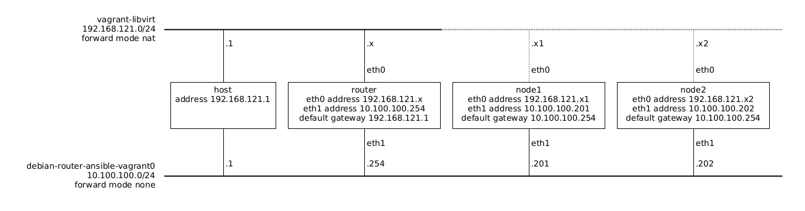

# About

This is an example debian linux router provisioned by ansible in a vagrant
environment.

Vagrant VMs need to have a management network wich is NATted by the host,
but that makes it difficult to play with the linux router, so this essentially
adds a secondary network interface that is used for routing, and replaces the
default route that is set by DHCP in `eth0` to use our router in `eth1`
instead. So everything that would be normally done at `eth0` must be done
in `eth1`.

The network is setup as:



**NB** The dotted lines represent a network connection that is not directly used, instead, the traffic in those nodes goes through `eth1` and is routed by the `router` machine.

**NB** For a non-ansible equivalent of this environment see
[rgl/debian-router-vagrant](https://github.com/rgl/debian-router-vagrant).

## Usage

Install the [base debian box](https://github.com/rgl/debian-vagrant).

Install ansible in a python venv:

```bash
# NB this will use sudo to install system dependencies.
bash ansible-install.sh
```

Start this environment:

```bash
source ansible-env.sh
time vagrant up --provider=libvirt --no-destroy-on-error --no-tty
```

You can later trigger the ansible playbook execution with `vagrant`:

```bash
vagrant up --provision
```

You can also directly trigger the ansible playbook execution with
`ansible-playbook`:

```bash
ansible-inventory --list --yaml
ansible-playbook playbook.yml --check --diff #-vvv
ansible-playbook playbook.yml --diff #-vvv
```

## Network Packet Capture

You can easily capture and see traffic from the host with the `wireshark.sh`
script, e.g., to capture the traffic from the `eth1` interface on each VM:

```bash
./wireshark.sh router eth1 # or any
./wireshark.sh node1 eth1 # or any
./wireshark.sh node2 eth1 # or any
```

## Reference

* https://www.vagrantup.com/docs/provisioning/ansible_intro
* https://www.vagrantup.com/docs/provisioning/ansible_common
* https://www.vagrantup.com/docs/provisioning/ansible
* https://docs.ansible.com/ansible-core/2.11/user_guide/playbooks.html
* https://docs.ansible.com/ansible-core/2.11/user_guide/playbooks_best_practices.html
* https://docs.ansible.com/ansible-core/2.11/reference_appendices/YAMLSyntax.html
